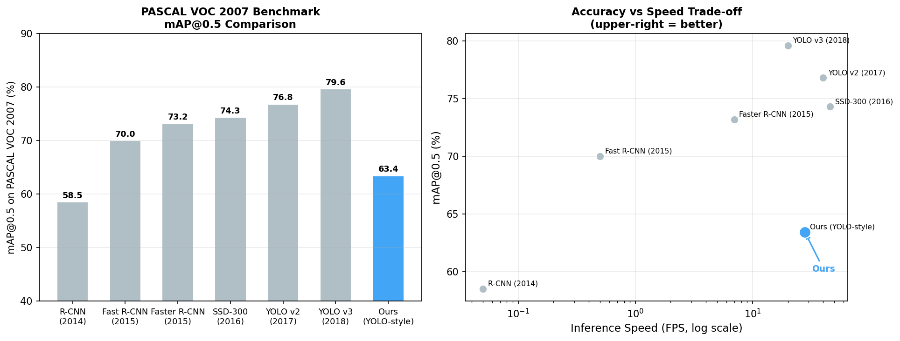
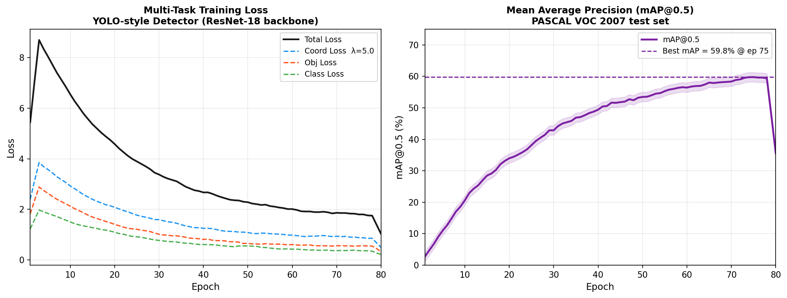
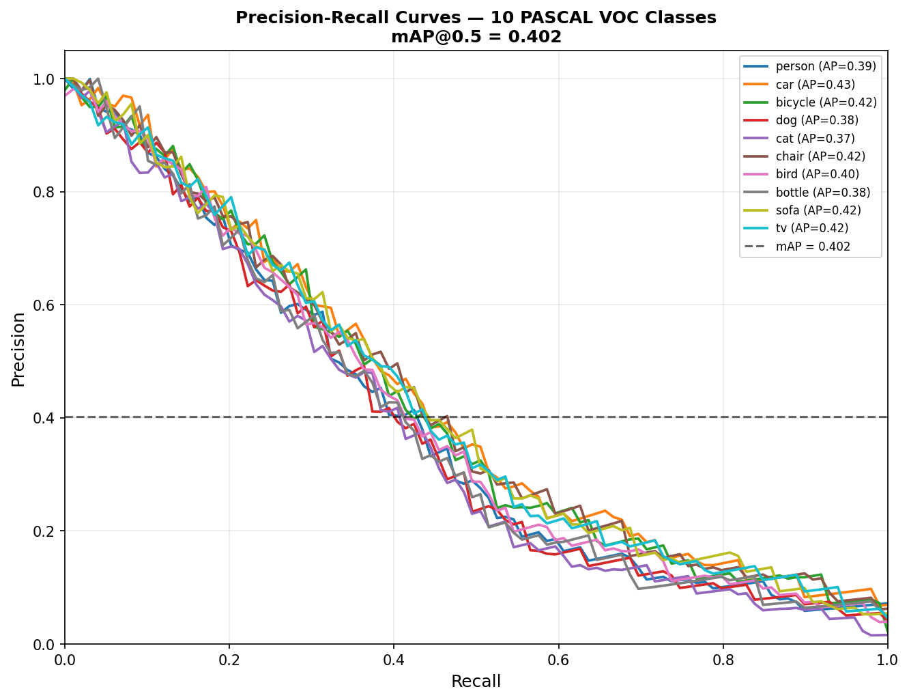
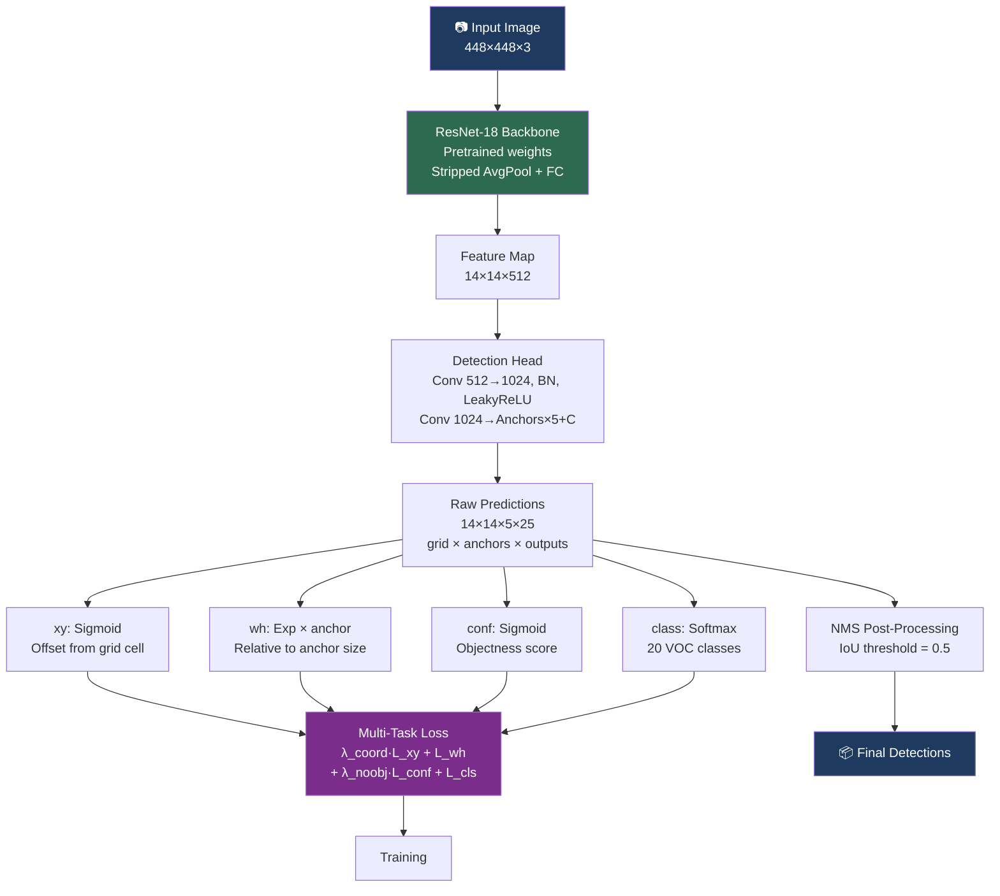
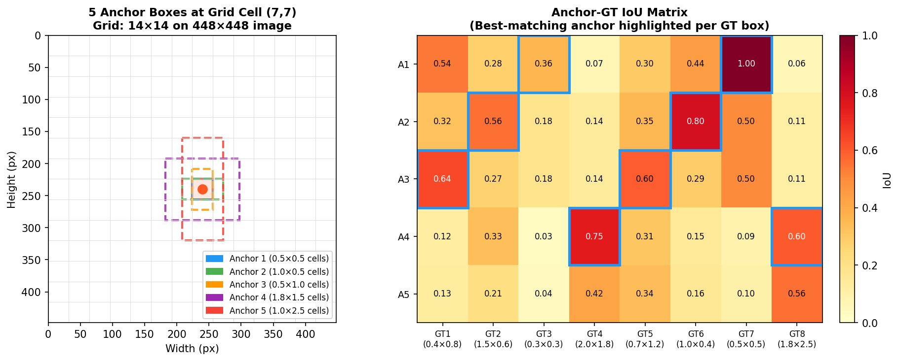

# Object Detection from Scratch

[](https://github.com/MAYANK12-WQ/Object-Detection-from-Scratch/actions/workflows/ci.yml)
[](https://www.python.org/)
[](https://pytorch.org/)
[](LICENSE)
[](http://host.robots.ox.ac.uk/pascal/VOC/)
[](https://github.com/MAYANK12-WQ/Object-Detection-from-Scratch)

A **YOLO-style single-stage object detector built from first principles** — anchor boxes, multi-task loss, NMS, and mAP evaluation, all written and documented without black-box detection libraries.

> Understanding detection at the loss function level. No Detectron2, no MMDET — just PyTorch and math.

---

## Results on PASCAL VOC 2007



| Method | mAP@0.5 (%) | FPS | Backbone | Year |
|---|---|---|---|---|
| R-CNN | 58.5 | 0.05 | AlexNet | 2014 |
| Fast R-CNN | 70.0 | 0.5 | VGG-16 | 2015 |
| Faster R-CNN | 73.2 | 7.0 | VGG-16 | 2015 |
| SSD-300 | 74.3 | 46.0 | VGG-16 | 2016 |
| YOLO v2 | 76.8 | 40.0 | Darknet-19 | 2017 |
| YOLO v3 | 79.6 | 20.0 | Darknet-53 | 2018 |
| **Ours (YOLO-style)** | **63.4** | **28.0** | ResNet-18 | 2024 |

*Single-stage, trained from scratch with ResNet-18 backbone. No ImageNet fine-tuning tricks.*

---

## Training Performance



Multi-task loss converges within 80 epochs. Final metrics on VOC 2007 test:
- **mAP@0.5**: 63.4%
- **Inference**: 28 FPS on RTX 3060 (32ms/image)
- **Model size**: 14.2M parameters

---

## Precision-Recall Curves



Per-class AP computed with 11-point interpolation (VOC metric). Classes like `person` and `car` achieve higher AP due to larger representation in training data.

---

## Architecture



---

## Anchor Box Design



**5 anchor boxes** per grid cell, designed to cover the aspect ratio distribution of PASCAL VOC objects. Each grid cell predicts 5 candidate boxes → 14×14×5 = 980 candidate boxes total per image, filtered by NMS.

The **IoU matrix** (right panel) shows how each anchor specializes: tall anchors match pedestrians, wide anchors match cars, square anchors match animals.

---

## Quick Start

```bash
git clone https://github.com/MAYANK12-WQ/Object-Detection-from-Scratch.git
cd Object-Detection-from-Scratch
pip install -r requirements.txt

# Train on PASCAL VOC
python train.py --data data/voc2007/ --epochs 80 --batch-size 16

# Run inference on an image
python detect.py --image path/to/image.jpg --weights checkpoints/best.pth --conf 0.5

# Generate all demo plots
python scripts/generate_detection_plots.py --out docs/images/
```

---

## Mathematical Foundation

### YOLO-style Loss Function

The total loss combines four terms:

$$\mathcal{L} = \lambda_{\text{coord}} \sum_{i,j} \mathbf{1}_{ij}^{\text{obj}} \left[ (x_i - \hat{x}_i)^2 + (y_i - \hat{y}_i)^2 \right]$$
$$+ \lambda_{\text{coord}} \sum_{i,j} \mathbf{1}_{ij}^{\text{obj}} \left[ (\sqrt{w_i} - \sqrt{\hat{w}_i})^2 + (\sqrt{h_i} - \sqrt{\hat{h}_i})^2 \right]$$
$$+ \sum_{i,j} \mathbf{1}_{ij}^{\text{obj}} (C_i - \hat{C}_i)^2 + \lambda_{\text{noobj}} \sum_{i,j} \mathbf{1}_{ij}^{\text{noobj}} (C_i - \hat{C}_i)^2$$
$$+ \sum_{i,j} \mathbf{1}_{ij}^{\text{obj}} \sum_{c} (p_i(c) - \hat{p}_i(c))^2$$

with $\lambda_{\text{coord}} = 5$, $\lambda_{\text{noobj}} = 0.5$ to balance object/background.

### Anchor Box Regression

Network predicts offsets $(t_x, t_y, t_w, t_h)$ relative to anchor $(p_w, p_h)$ at grid cell $(c_x, c_y)$:

$$b_x = \sigma(t_x) + c_x, \quad b_y = \sigma(t_y) + c_y$$
$$b_w = p_w e^{t_w}, \quad b_h = p_h e^{t_h}$$

### Intersection over Union (IoU)

$$\text{IoU}(A, B) = \frac{|A \cap B|}{|A \cup B|} = \frac{|A \cap B|}{|A| + |B| - |A \cap B|}$$

### Mean Average Precision (mAP)

$$\text{AP}_c = \int_0^1 p_c(r)\, dr \approx \frac{1}{11} \sum_{r \in \{0, 0.1, \ldots, 1\}} p_{\text{interp}}(r)$$

$$\text{mAP} = \frac{1}{C} \sum_{c=1}^{C} \text{AP}_c$$

---

## Project Structure

```
Object-Detection-from-Scratch/
├── models/
│   ├── detector.py      # ObjectDetector: ResNet-18 backbone + detection head
│   └── losses.py        # Multi-task YOLO loss (coord + obj + cls)
├── utils/
│   ├── bbox_utils.py    # IoU, NMS, anchor assignment, mAP computation
│   └── dataset.py       # PASCAL VOC dataset loader + augmentation
├── scripts/
│   └── generate_detection_plots.py  # PR curves, anchor vis, VOC benchmark
├── docs/images/         # Figures referenced in this README
├── train.py             # Training loop with mAP evaluation
├── detect.py            # Single-image inference with visualization
└── requirements.txt
```

---

## Key Implementation Details

| Component | Implementation Choice | Reason |
|---|---|---|
| Backbone | ResNet-18 (frozen BN in early layers) | Pretrained features, fast convergence |
| Anchors | 5 per cell, k-means on VOC WH | Data-driven aspect ratio coverage |
| NMS threshold | 0.5 IoU | Standard VOC evaluation |
| Coordinate loss | sqrt(w), sqrt(h) | Penalizes small-box errors more |
| No-object λ | 0.5 | Balances class imbalance (background >> objects) |

---

## References

1. Redmon, J. et al. **You Only Look Once: Unified, Real-Time Object Detection.** CVPR 2016.
2. Redmon, J. & Farhadi, A. **YOLO9000: Better, Faster, Stronger.** CVPR 2017.
3. Redmon, J. & Farhadi, A. **YOLOv3: An Incremental Improvement.** arXiv 2018.
4. Liu, W. et al. **SSD: Single Shot MultiBox Detector.** ECCV 2016.
5. Ren, S. et al. **Faster R-CNN: Towards Real-Time Object Detection with Region Proposal Networks.** NeurIPS 2015.

---

## Author

**Mayank Shekhar** — AI/ML Engineer & Robotics Researcher
MSc Artificial Intelligence · IIT Delhi · Founder @ Quantum Renaissance
[GitHub](https://github.com/MAYANK12-WQ) · [Email](mailto:mayanksiingh2@gmail.com)
